# Aeroponic Potatoes: Image-Based Root Growth Monitoring

This project monitors **potato root and tuber growth** in an aeroponic system. A camera inside the root
chamber takes pictures automatically, and computer vision estimates **root length in centimetres**:
**YOLO11s** detects roots and **U-Net** segments them.

<p align="center">
  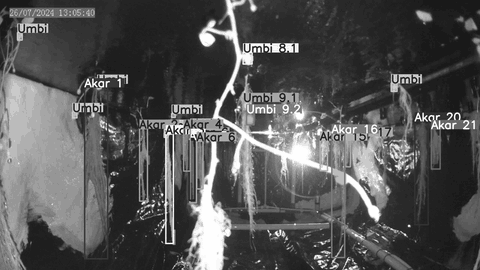<br>
  <sub>Root chamber timelapse, Camera 2, July – September 2024 ·
  <a href="docs/timelapse.mp4">full video (MP4, 1280×720)</a></sub>
</p>

---

## Table of Contents

- [System Architecture](#system-architecture)
- [Repository Structure](#repository-structure)
- [Dataset](#dataset)
- [Methods](#methods)
  - [1. Frame selection](#1-frame-selection)
  - [2. Camera calibration](#2-camera-calibration--undistortion)
  - [3. Annotation](#3-annotation)
  - [4. Root detection with YOLO11s](#4-root-detection-with-yolo11s)
  - [5. Root segmentation with U-Net](#5-root-segmentation-with-u-net)
  - [6. Root length measurement](#6-root-length-measurement)
- [Results](#results)
- [Getting Started](#getting-started)
- [Notes & Limitations](#notes--limitations)

---

## System Architecture

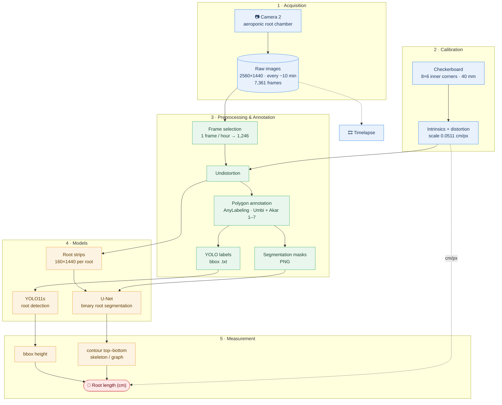

| Stage | Input | Process | Output |
|---|---|---|---|
| Acquisition | Camera 2 in the root chamber | Automatic capture every ~10 min | 2560×1440 JPG images |
| Frame selection | Raw images | Keep the first frame of every hour | Clean subset |
| Calibration | Checkerboard images | `cv2.calibrateCamera` + `undistort` | Intrinsic matrix, distortion coefficients, cm/px scale |
| Annotation | Clean subset | Polygons drawn in AnyLabeling | JSON (polygons), YOLO txt (bbox), PNG masks |
| Models | Images + labels | YOLO11s (detection), U-Net (segmentation) | Root bounding boxes / masks |
| Measurement | Bbox / mask | Contour, skeleton, scale conversion | Root length (cm) |

---

## Repository Structure

```
aeroponic-potatoes/
├── README.md
├── requirements.txt
├── notebooks/
│   ├── 01_data_cleaning.ipynb               # keep 1 frame per hour
│   ├── 02_camera_calibration.ipynb          # checkerboard calibration + undistortion
│   ├── 03_yolo_root_detection.ipynb         # YOLO11s training/inference + bbox height (cm)
│   ├── 04_unet_segmentation_training.ipynb  # U-Net architecture & training
│   └── 05_unet_inference_root_length.ipynb  # mask prediction + root length (contour/skeleton)
├── scripts/
│   ├── select_hourly_frames.py              # script version of notebook 01
│   ├── crop_root_strips.py                  # crop an image into 160×1440 strips, one per root
│   ├── json_to_mask.py                      # JSON annotations → PNG masks
│   └── make_readme_figures.py               # regenerates every figure in docs/images
└── docs/
    ├── images/                              # README figures
    ├── root_label_map_camera2.pdf           # root numbering map for Camera 2
    ├── timelapse.mp4                        # timelapse (compressed)
    └── yolo_tutorial_link.txt
```

The following folders **exist only locally**. They are listed in `.gitignore` (about 9 GB in total):

```
dataset/
└── 2024-07 | 2024-08 | 2024-09/
    ├── raw/          # raw images (one every ~10 min)
    ├── clean/        # one image per hour (+ JSON annotations)
    ├── labels_json/  # AnyLabeling polygon annotations
    └── labels_yolo/  # images/, labels/, classes.txt (YOLO format)
tools/anylabeling/    # annotation tool (AnyLabeling clone)
```

---

## Dataset

All images come from **Camera 2**, which faces the root chamber of the aeroponic system.
The images are grayscale at **2560 × 1440** resolution.

| Month | Period | Days recorded | Raw images | Clean (1/hour) | Annotated |
|---|---|:---:|---:|---:|---:|
| July 2024 | 26 – 31 Jul | 6 | 803 | 136 | 135 |
| August 2024 | 1 – 31 Aug | 31 | 4,393 | 743 | 743 |
| September 2024 | 1 – 21 Sep | 17 | 2,165 | 367 | 366 |
| **Total** | | **54** | **7,361** | **1,246** | **1,244** |

<p align="center">
  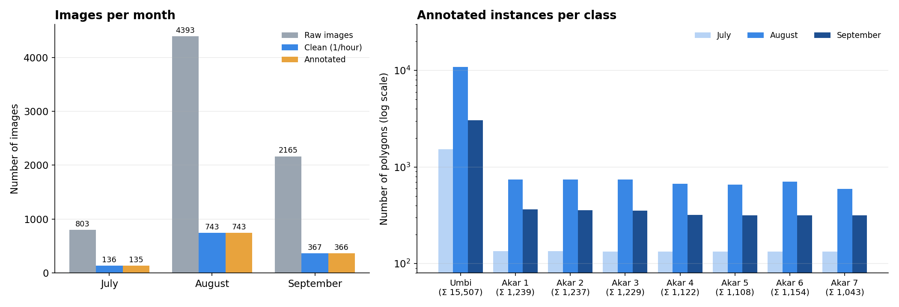
</p>

### Growth across months

Left: day (12:00). Right: night (00:00). Roots and tubers increase visibly from July to September.

<p align="center">
  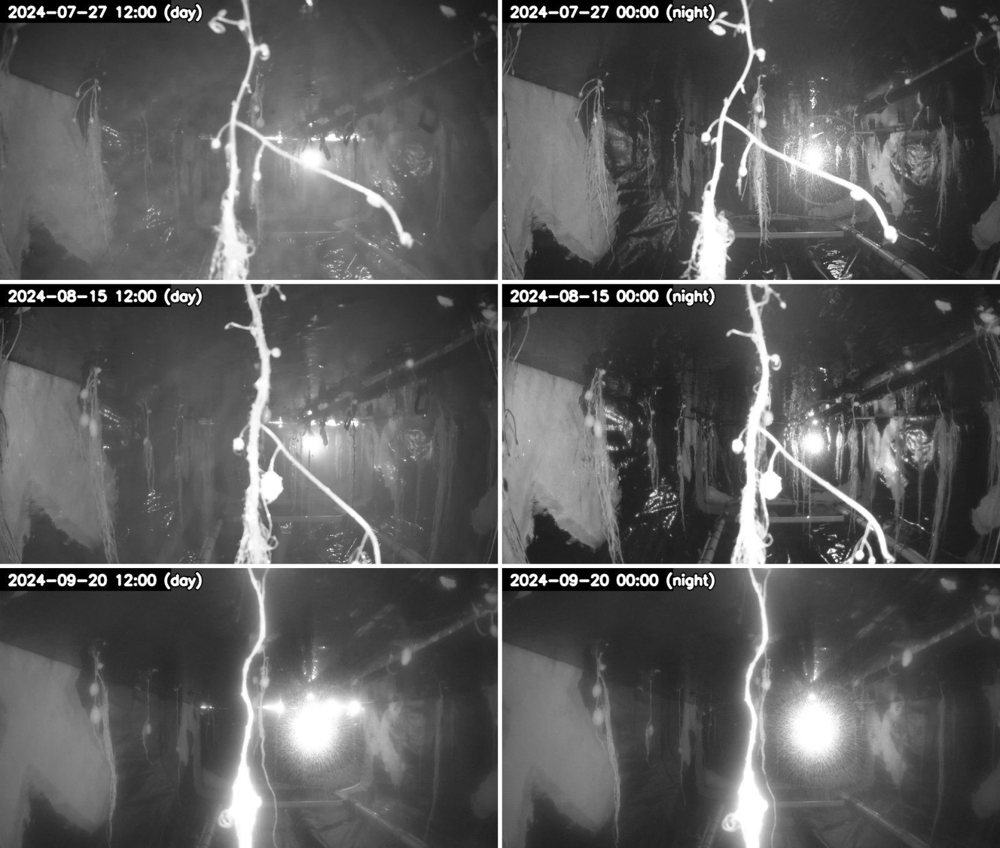
</p>

### Annotation classes

Each image is annotated with **8 classes**: one tuber class and seven individually tracked roots.
The class names are in Indonesian: *Umbi* = tuber, *Akar* = root. Roots are numbered according to the
map below.

| ID | Class | Polygons | Description |
|:---:|---|---:|---|
| 0 | Akar 1 | 1,239 | tracked root #1 (left → right) |
| 1 | Akar 2 | 1,237 | tracked root #2 |
| 2 | Akar 3 | 1,229 | tracked root #3 |
| 3 | Akar 4 | 1,122 | tracked root #4 |
| 4 | Akar 5 | 1,108 | tracked root #5 |
| 5 | Akar 6 | 1,154 | tracked root #6 |
| 6 | Akar 7 | 1,043 | tracked root #7 |
| 7 | Umbi | 15,507 | every visible tuber |

<p align="center">
  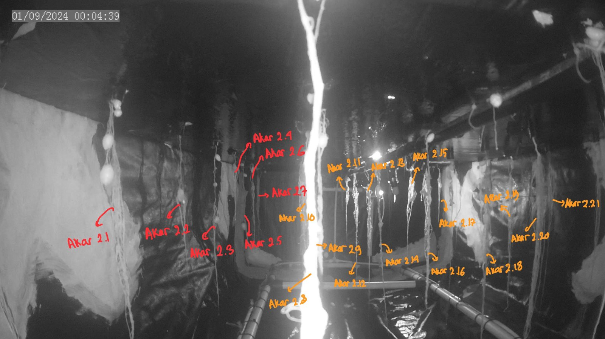<br>
  <sub>Root numbering map for Camera 2 (<a href="docs/root_label_map_camera2.pdf">PDF</a>)</sub>
</p>

---

## Methods

### 1. Frame selection

The camera captures about 6 images per hour. To reduce redundancy, only the **first frame of every hour**
is kept, based on the file name `YYYY-MM-DD_HH-MM-SS.jpg`
([`notebooks/01_data_cleaning.ipynb`](notebooks/01_data_cleaning.ipynb),
[`scripts/select_hourly_frames.py`](scripts/select_hourly_frames.py)).
This leaves about 24 images per day and reduces the dataset from 7,361 to 1,246 images.

### 2. Camera calibration & undistortion

The camera has a wide-angle lens with noticeable *barrel* distortion. It was calibrated with a
**checkerboard of 8 × 6 inner corners** and **40 mm** squares
([`notebooks/02_camera_calibration.ipynb`](notebooks/02_camera_calibration.ipynb)).

<p align="center">
  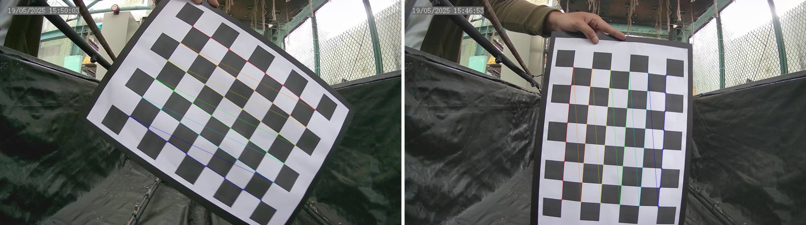
</p>

| Parameter | Value |
|---|---|
| Checkerboard pattern | 8 × 6 inner corners |
| Square size | 40 mm |
| Algorithm | `findChessboardCorners` → `cornerSubPix` → `calibrateCamera` |
| Correction | `getOptimalNewCameraMatrix` (α = 1) + `undistort`, ROI crop |
| **Calibrated scale** | **0.0511 cm/pixel** (~19.6 px/cm) |
| Outputs | `camera_calibration_parameters.npz`, `scale.txt` |

### 3. Annotation

Polygons were drawn in [AnyLabeling](https://github.com/vietanhdev/anylabeling) and then converted
into two formats: **YOLO bounding boxes** for detection and **PNG masks** for segmentation
([`scripts/json_to_mask.py`](scripts/json_to_mask.py); tuber = 128, root = 255).

<p align="center">
  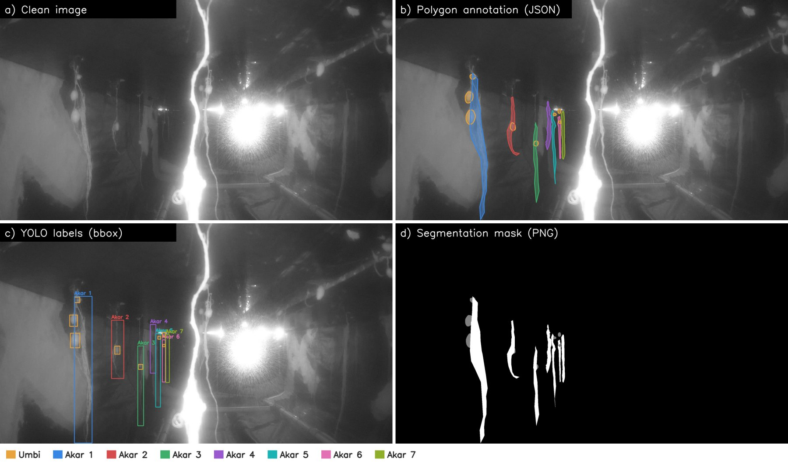
</p>

### 4. Root detection with YOLO11s

An Ultralytics **YOLO11s** model was trained to detect roots as a single class (`Akar Kentang`,
"potato root") on undistorted images. Root length is then estimated as
**bounding-box height × calibration scale**
([`notebooks/03_yolo_root_detection.ipynb`](notebooks/03_yolo_root_detection.ipynb)).

| Hyperparameter | Value |
|---|---|
| Pretrained weights | `yolo11s.pt` (9.4 M parameters, 21.3 GFLOPs) |
| Dataset | 200 images → 180 train / 20 validation (90:10) |
| Epochs | 60 |
| Image size | 640 |
| Batch size | 16 |
| Hardware | Google Colab, NVIDIA Tesla T4 |
| Training time | ~4.7 min (0.078 h) |

### 5. Root segmentation with U-Net

A classic U-Net (Keras/TensorFlow) performs binary root segmentation
([`notebooks/04_unet_segmentation_training.ipynb`](notebooks/04_unet_segmentation_training.ipynb)).

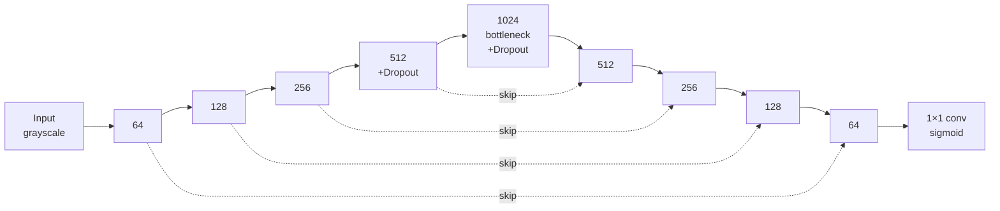

| Component | Details |
|---|---|
| Input | grayscale, normalised to 0–1 |
| Encoder | 4 blocks of 2× Conv3×3 (64 → 128 → 256 → 512) + MaxPool 2×2, Dropout 0.5 in block 4 |
| Bottleneck | 2× Conv3×3 with 1024 filters, Dropout 0.5 |
| Decoder | UpSampling 2×2 + Conv2×2 + skip connection, 512 → 256 → 128 → 64 |
| Output | Conv1×1, sigmoid (1 channel) |
| Parameters | **31,030,593** (118 MB) |
| Loss / optimiser | binary cross-entropy / Adam |

Training at the full **2560×1440** resolution ran out of GPU memory on a Colab T4 (one activation tensor
alone needed ~3.8 GB). The images are therefore cropped into **vertical 160 × 1440 px strips, one per root**,
before they go into the model ([`scripts/crop_root_strips.py`](scripts/crop_root_strips.py)).

### 6. Root length measurement

Three approaches were tested on the U-Net masks
([`notebooks/05_unet_inference_root_length.ipynb`](notebooks/05_unet_inference_root_length.ipynb)):

| Approach | How it works | Status |
|---|---|---|
| Skeleton (pixel count) | `skeletonize` → number of skeleton pixels ÷ px/cm | experimental |
| Skeleton + graph (`skan`) | branch analysis: total length, longest branch | experimental |
| **Vertical contour** | take the largest contour crossing the strip centre (x = 75–85), then measure from its topmost to its bottommost point ÷ px/cm | **used** |

The px/cm factor depends on how far the root is from the camera:

| Position | a3 | a4 | a5 | a6 |
|---|---:|---:|---:|---:|
| px/cm | 29 | 18 | 13.5 | 11.5 |

---

## Results

### YOLO11s detection

| Metric (validation, 20 images) | Value |
|---|---:|
| Precision | **0.997** |
| Recall | **1.000** |
| mAP@50 | **0.995** |
| mAP@50-95 | **0.837** |
| Inference speed (T4) | 2.7 ms/image |

<p align="center">
  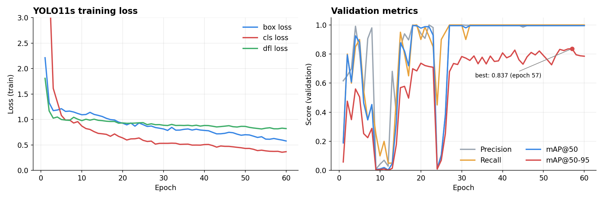
</p>

Validation metrics were unstable around epochs 9–13 and 24–26. After about epoch 27 they
converged (mAP@50 ≈ 0.995). The per-epoch log is in
[`docs/images/yolo_training_log.csv`](docs/images/yolo_training_log.csv).

**Example predictions.** Left: detection with confidence. Right: estimated root length (bbox height × 0.0511 cm/px).

<p align="center">
  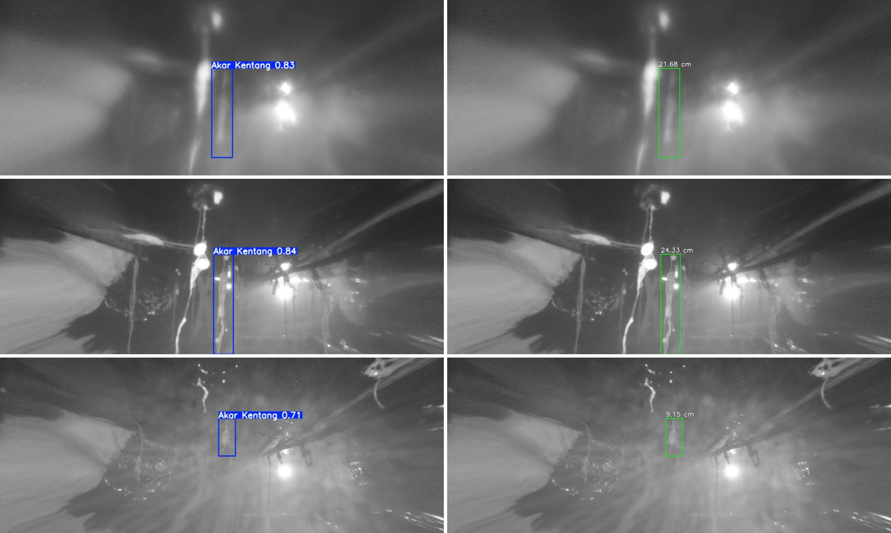
</p>

| Example | Confidence | Estimated length |
|---|---:|---:|
| 1 | 0.83 | 21.68 cm |
| 2 | 0.84 | 24.33 cm |
| 3 | 0.71 | 9.15 cm |

### U-Net segmentation & measurement

<p align="center">
  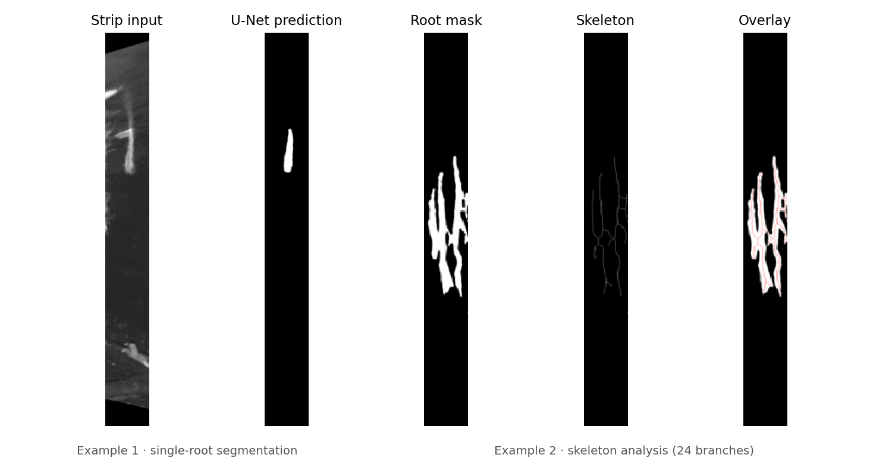
</p>

| Test image | Method | px/cm | Result |
|---|---|---:|---|
| `crop_10` | vertical contour (final) | 18 | 158 px → **8.78 cm** |
| `crop_5` | contour (centroid x = 70–90) | 30.8 | 203 px → **6.59 cm** |
| `koreksi_302` | largest contour | 18.5 | 373 px → **20.16 cm** |
| `koreksi_302` | skeleton + `skan` | 14 | 24 branches, 117.51 cm total, longest branch **16.20 cm** |

---

## Getting Started

```bash
git clone git@github.com:izmaherdian/aeroponic-potatoes.git
cd aeroponic-potatoes
pip install -r requirements.txt

# 1. keep one frame per hour
python scripts/select_hourly_frames.py dataset/2024-08/raw dataset/2024-08/clean

# 2. convert annotations into PNG masks
python scripts/json_to_mask.py dataset/2024-08/labels_json -o masks

# 3. crop an undistorted image into one strip per root
python scripts/crop_root_strips.py koreksi_151.jpg -o crops --prefix crop15

# 4. regenerate the README figures (requires the local dataset/ folder)
python scripts/make_readme_figures.py
```

Notebooks `02`–`05` were run on **Google Colab** (T4 GPU) with the data stored on Google Drive.
Update the paths in the first cells of each notebook before running them.

---

## Notes & Limitations

- **The dataset is not included** in this repository because it is about 9 GB.
- The camera's on-screen clock (OSD) reset in September and shows the year 2011. Use the
  **file name** as the true timestamp.
- The YOLO validation set has only 20 images and a single class, so its metrics are very high. The model
  should be evaluated on a larger set and per class (Akar 1–7).
- The calibrated cm/px scale is only accurate on the checkerboard plane. Roots at other depths need their
  own scale factor (a3–a6).
- Full-resolution U-Net training does not fit in Colab GPU memory, so per-root strips are used instead.

---

<sub>Master's project, Instrumentation and Control, Institut Teknologi Bandung · Izma Alhazmi Herdian</sub>
