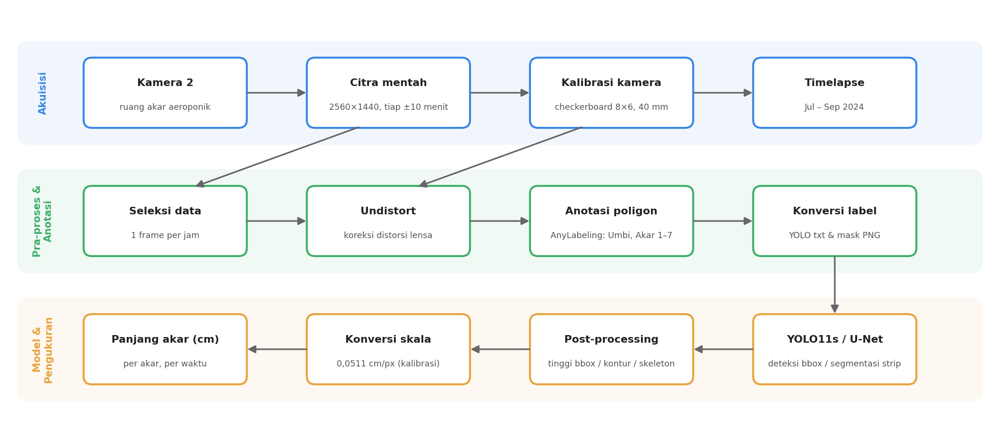

# Aeroponic Potatoes — Pemantauan Pertumbuhan Akar Kentang Aeroponik Berbasis Citra

Pemantauan pertumbuhan **akar dan umbi kentang** pada sistem aeroponik menggunakan kamera
di ruang akar, lalu mengukur **panjang akar (cm)** secara otomatis dengan *computer vision*
(**YOLO11s** untuk deteksi dan **U-Net** untuk segmentasi).

<p align="center">
  <br>
  <sub>Timelapse ruang akar Kamera 2, Juli – September 2024 ·
  <a href="docs/timelapse.mp4">video lengkap (MP4, 1280×720)</a></sub>
</p>

---

## Daftar Isi

- [Arsitektur Sistem](#arsitektur-sistem)
- [Struktur Repositori](#struktur-repositori)
- [Dataset](#dataset)
- [Metode](#metode)
  - [1. Seleksi data](#1-seleksi-data-bersih)
  - [2. Kalibrasi kamera](#2-kalibrasi-kamera--koreksi-distorsi)
  - [3. Anotasi](#3-anotasi)
  - [4. Deteksi akar dengan YOLO11s](#4-deteksi-akar-dengan-yolo11s)
  - [5. Segmentasi akar dengan U-Net](#5-segmentasi-akar-dengan-u-net)
  - [6. Pengukuran panjang akar](#6-pengukuran-panjang-akar)
- [Hasil](#hasil)
- [Cara Menjalankan](#cara-menjalankan)
- [Catatan & Keterbatasan](#catatan--keterbatasan)

---

## Arsitektur Sistem

<p align="center">
  
</p>

| Tahap | Masukan | Proses | Keluaran |
|---|---|---|---|
| Akuisisi | Kamera 2 di ruang akar | Perekaman otomatis tiap ±10 menit | Citra 2560×1440 JPG |
| Seleksi data | Citra mentah | Ambil 1 frame pertama tiap jam | Data bersih |
| Kalibrasi | Citra checkerboard | `cv2.calibrateCamera` + `undistort` | Matriks intrinsik, koef. distorsi, skala cm/px |
| Anotasi | Data bersih | Poligon di AnyLabeling | JSON (poligon), YOLO txt (bbox), mask PNG |
| Model | Citra + label | YOLO11s (deteksi), U-Net (segmentasi) | Bounding box / mask akar |
| Pengukuran | Bbox / mask | Kontur, skeleton, konversi skala | Panjang akar (cm) |

---

## Struktur Repositori

```
aeroponic-potatoes/
├── README.md
├── requirements.txt
├── notebooks/
│   ├── 01_data_cleaning.ipynb               # seleksi 1 frame/jam
│   ├── 02_camera_calibration.ipynb          # kalibrasi checkerboard + undistort
│   ├── 03_yolo_root_detection.ipynb         # training & inferensi YOLO11s + tinggi bbox (cm)
│   ├── 04_unet_segmentation_training.ipynb  # arsitektur & training U-Net
│   └── 05_unet_inference_root_length.ipynb  # prediksi mask + panjang akar (kontur/skeleton)
├── scripts/
│   ├── select_hourly_frames.py              # versi skrip dari notebook 01
│   ├── crop_root_strips.py                  # potong citra jadi strip 160×1440 per akar
│   ├── json_to_mask.py                      # anotasi JSON → mask PNG
│   └── make_readme_figures.py               # membuat semua gambar di docs/images
└── docs/
    ├── images/                              # gambar README
    ├── root_label_map_camera2.pdf           # peta penomoran akar Kamera 2
    ├── timelapse.mp4                        # timelapse (terkompresi)
    └── yolo_tutorial_link.txt
```

Folder berikut **hanya ada di lokal** (di-`.gitignore`, total ±9 GB):

```
dataset/
└── 2024-07 | 2024-08 | 2024-09/
    ├── raw/          # citra mentah (±10 menit sekali)
    ├── clean/        # 1 citra per jam (+ JSON anotasi)
    ├── labels_json/  # anotasi poligon AnyLabeling
    └── labels_yolo/  # images/, labels/, classes.txt (format YOLO)
tools/anylabeling/    # tool anotasi (clone AnyLabeling)
```

---

## Dataset

Citra diambil dari **Kamera 2** yang menghadap ruang akar sistem aeroponik (grayscale,
resolusi **2560 × 1440**).

| Bulan | Periode | Hari terekam | Citra mentah | Data bersih (1/jam) | Teranotasi |
|---|---|:---:|---:|---:|---:|
| Juli 2024 | 26 – 31 Jul | 6 | 803 | 136 | 135 |
| Agustus 2024 | 1 – 31 Agu | 31 | 4.393 | 743 | 743 |
| September 2024 | 1 – 21 Sep | 17 | 2.165 | 367 | 366 |
| **Total** | | **54** | **7.361** | **1.246** | **1.244** |

<p align="center">
  
</p>

### Perkembangan visual per bulan

Kiri: siang (12:00), kanan: malam (00:00). Terlihat akar dan umbi yang makin banyak dari Juli ke September.

<p align="center">
  
</p>

### Kelas anotasi

Setiap citra dianotasi dengan **8 kelas**: 1 kelas umbi dan 7 akar yang dilacak secara konsisten
(penomoran mengikuti peta akar di bawah).

| ID | Kelas | Jumlah poligon | Keterangan |
|:---:|---|---:|---|
| 0 | Akar 1 | 1.239 | akar yang dilacak (kiri → kanan) |
| 1 | Akar 2 | 1.237 | |
| 2 | Akar 3 | 1.229 | |
| 3 | Akar 4 | 1.122 | |
| 4 | Akar 5 | 1.108 | |
| 5 | Akar 6 | 1.154 | |
| 6 | Akar 7 | 1.043 | |
| 7 | Umbi | 15.507 | seluruh umbi yang terlihat |

<p align="center">
  <br>
  <sub>Peta penomoran akar Kamera 2 (<a href="docs/root_label_map_camera2.pdf">PDF</a>)</sub>
</p>

---

## Metode

### 1. Seleksi data bersih

Kamera merekam ±6 citra per jam. Untuk mengurangi redundansi, diambil **frame pertama setiap jam**
berdasarkan nama file `YYYY-MM-DD_HH-MM-SS.jpg`
([`notebooks/01_data_cleaning.ipynb`](notebooks/01_data_cleaning.ipynb),
[`scripts/select_hourly_frames.py`](scripts/select_hourly_frames.py)).
Hasilnya ±24 citra/hari, dari 7.361 menjadi 1.246 citra.

### 2. Kalibrasi kamera & koreksi distorsi

Lensa kamera bersudut lebar sehingga ada distorsi *barrel*. Kalibrasi memakai papan
**checkerboard 8 × 6 sudut dalam** dengan ukuran kotak **40 mm**
([`notebooks/02_camera_calibration.ipynb`](notebooks/02_camera_calibration.ipynb)).

<p align="center">
  
</p>

| Parameter | Nilai |
|---|---|
| Pola checkerboard | 8 × 6 sudut dalam |
| Ukuran kotak | 40 mm |
| Algoritma | `findChessboardCorners` → `cornerSubPix` → `calibrateCamera` |
| Koreksi | `getOptimalNewCameraMatrix` (α = 1) + `undistort`, crop ROI |
| **Skala hasil kalibrasi** | **0,0511 cm/piksel** (±19,6 px/cm) |
| Output | `camera_calibration_parameters.npz`, `scale.txt` |

### 3. Anotasi

Anotasi poligon dilakukan dengan [AnyLabeling](https://github.com/vietanhdev/anylabeling)
lalu dikonversi ke dua format: **bounding box YOLO** untuk deteksi dan **mask PNG** untuk segmentasi
([`scripts/json_to_mask.py`](scripts/json_to_mask.py); umbi = 128, akar = 255).

<p align="center">
  
</p>

### 4. Deteksi akar dengan YOLO11s

Model **YOLO11s** (Ultralytics) dilatih untuk mendeteksi akar (kelas tunggal `Akar Kentang`)
pada citra yang sudah dikoreksi distorsi, lalu **tinggi bounding box × skala kalibrasi** dipakai
sebagai estimasi panjang akar
([`notebooks/03_yolo_root_detection.ipynb`](notebooks/03_yolo_root_detection.ipynb)).

| Hyperparameter | Nilai |
|---|---|
| Model awal | `yolo11s.pt` (9,4 juta parameter, 21,3 GFLOPs) |
| Dataset | 200 citra → 180 train / 20 validasi (90:10) |
| Epoch | 60 |
| Ukuran input | 640 |
| Batch | 16 |
| Hardware | Google Colab, NVIDIA Tesla T4 |
| Waktu training | ±4,7 menit (0,078 jam) |

### 5. Segmentasi akar dengan U-Net

U-Net klasik (Keras/TensorFlow) untuk segmentasi biner akar
([`notebooks/04_unet_segmentation_training.ipynb`](notebooks/04_unet_segmentation_training.ipynb)).

| Komponen | Detail |
|---|---|
| Input | grayscale, dinormalisasi 0–1 |
| Encoder | 4 blok Conv3×3 ×2 (64 → 128 → 256 → 512) + MaxPool 2×2, Dropout 0,5 di blok 4 |
| Bottleneck | Conv3×3 ×2, 1024 filter, Dropout 0,5 |
| Decoder | UpSampling 2×2 + Conv2×2 + skip connection, 512 → 256 → 128 → 64 |
| Output | Conv1×1, sigmoid (1 kanal) |
| Parameter | **31.030.593** (118 MB) |
| Loss / optimizer | binary cross-entropy / Adam |

Karena training pada resolusi penuh **2560×1440** kehabisan memori GPU (Colab T4, *OOM* ±3,8 GB
per tensor aktivasi), citra dipotong menjadi **strip vertikal 160 × 1440 piksel per akar**
([`scripts/crop_root_strips.py`](scripts/crop_root_strips.py)) sebelum dimasukkan ke model.

### 6. Pengukuran panjang akar

Dari mask prediksi U-Net diuji tiga pendekatan
([`notebooks/05_unet_inference_root_length.ipynb`](notebooks/05_unet_inference_root_length.ipynb)):

| Pendekatan | Cara kerja | Status |
|---|---|---|
| Skeleton (piksel) | `skeletonize` → jumlah piksel skeleton ÷ px/cm | eksperimen |
| Skeleton + graph (`skan`) | analisis cabang: total panjang, cabang terpanjang | eksperimen |
| **Kontur vertikal** | kontur terbesar yang memotong pusat strip (x = 75–85) → jarak titik teratas–terbawah ÷ px/cm | **dipakai** |

Faktor skala px/cm disesuaikan dengan kedalaman posisi akar terhadap kamera:

| Posisi | a3 | a4 | a5 | a6 |
|---|---:|---:|---:|---:|
| px/cm | 29 | 18 | 13,5 | 11,5 |

---

## Hasil

### Deteksi YOLO11s

| Metrik (validasi, 20 citra) | Nilai |
|---|---:|
| Precision | **0,997** |
| Recall | **1,000** |
| mAP@50 | **0,995** |
| mAP@50-95 | **0,837** |
| Kecepatan inferensi (T4) | 2,7 ms/citra |

<p align="center">
  
</p>

Metrik validasi sempat tidak stabil pada epoch 9–13 dan 24–26, lalu konvergen setelah epoch ±27
(mAP@50 ≈ 0,995). Log per-epoch tersedia di [`docs/images/yolo_training_log.csv`](docs/images/yolo_training_log.csv).

**Contoh prediksi** — kiri: deteksi + *confidence*, kanan: estimasi panjang akar (tinggi bbox × 0,0511 cm/px):

<p align="center">
  
</p>

| Contoh | Confidence | Estimasi panjang |
|---|---:|---:|
| 1 | 0,83 | 21,68 cm |
| 2 | 0,84 | 24,33 cm |
| 3 | 0,71 | 9,15 cm |

### Segmentasi U-Net & pengukuran

<p align="center">
  
</p>

| Citra uji | Metode | px/cm | Hasil |
|---|---|---:|---|
| `crop_10` | kontur vertikal (final) | 18 | 158 px → **8,78 cm** |
| `crop_5` | kontur (centroid x = 70–90) | 30,8 | 203 px → **6,59 cm** |
| `koreksi_302` | kontur terbesar | 18,5 | 373 px → **20,16 cm** |
| `koreksi_302` | skeleton + `skan` | 14 | 24 cabang, total 117,51 cm, cabang terpanjang **16,20 cm** |

---

## Cara Menjalankan

```bash
git clone git@github.com:izmaherdian/aeroponic-potatoes.git
cd aeroponic-potatoes
pip install -r requirements.txt

# 1. seleksi 1 frame/jam
python scripts/select_hourly_frames.py dataset/2024-08/raw dataset/2024-08/clean

# 2. konversi anotasi ke mask PNG
python scripts/json_to_mask.py dataset/2024-08/labels_json -o masks

# 3. potong citra (sudah di-undistort) menjadi strip per akar
python scripts/crop_root_strips.py koreksi_151.jpg -o crops --prefix crop15

# 4. buat ulang gambar README (butuh folder dataset/ lokal)
python scripts/make_readme_figures.py
```

Notebook `02`–`05` dijalankan di **Google Colab** (GPU T4) dengan data di Google Drive;
sesuaikan path di sel awal tiap notebook.

---

## Catatan & Keterbatasan

- **Dataset tidak disertakan** di repositori karena ukurannya ±9 GB.
- Jam pada *overlay* kamera (OSD) sempat ter-*reset* di bulan September (tertulis 2011);
  waktu yang valid adalah **nama file**.
- Validasi YOLO hanya 20 citra dengan 1 kelas, sehingga metrik sangat tinggi dan perlu diuji pada
  set yang lebih besar dan per-kelas (Akar 1–7).
- Skala cm/px dari kalibrasi hanya akurat pada bidang checkerboard; akar pada kedalaman berbeda
  memerlukan faktor skala sendiri (a3–a6).
- Training U-Net resolusi penuh tidak muat di memori GPU Colab; digunakan strip per akar.

---

<sub>Proyek S2 Instrumentasi dan Kontrol — Institut Teknologi Bandung · Izma Alhazmi Herdian</sub>
